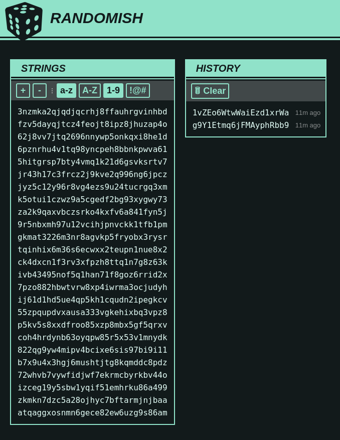

# Randomish

**Web page to generate random passwords and other randomish things**



There is no web server involvement. Everything happens inside the browser.

Generated data is saved to local storage for future reference (which can also be emptied).

Mostly just an excuse to play a bit with clojurescript.

### Development mode

Project is based on clojurescript + reagent + figwheel toolset ("frontend only" template).

To start dev environment, do:

```
lein figwheel
```

The project is setup to start nREPL on port `7002` once Figwheel starts.
Once you connect to the nREPL, run `(cljs)` to switch to the ClojureScript REPL.

### Building for production

```
lein clean
lein package
```

Run `scripts/deploy.sh` to deploy directly to github pages.
